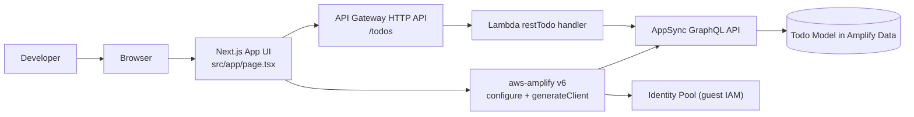
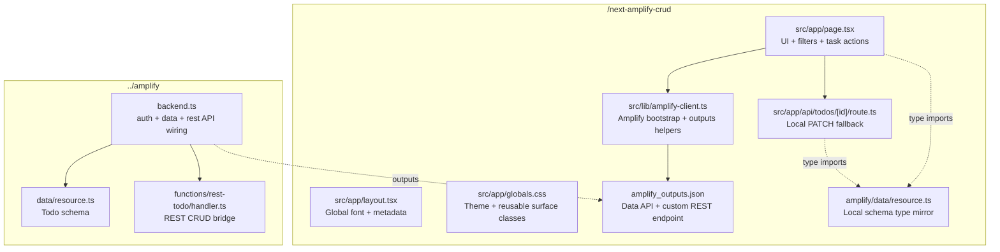
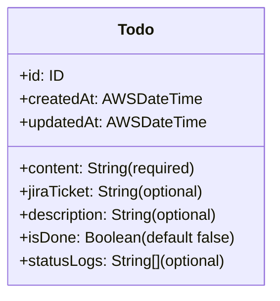
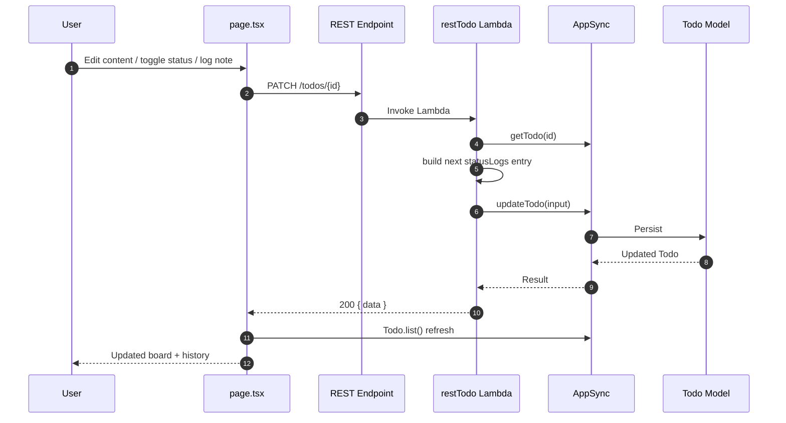
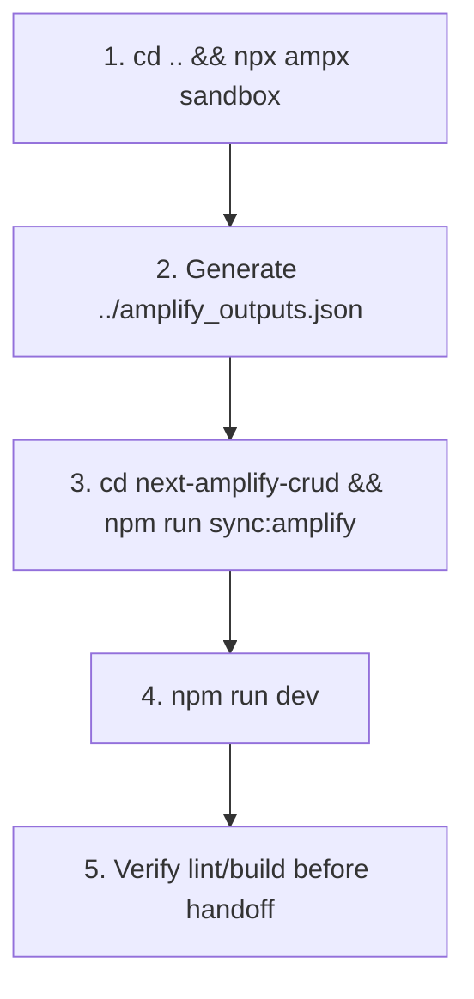

# Next + Amplify Jira Todo Architecture (Developer Design Document)

This document reflects the current implementation in this repository as of March 29, 2026.

- Frontend: `next-amplify-crud` (Next.js 16 + React 19)
- Backend definitions: `../amplify` (sandbox deploy source), mirrored in `next-amplify-crud/amplify` for local schema typing
- Runtime bridge: `amplify_outputs.json`

## 1) System Context

## 2) Repository and Module Architecture

## 3) Data Model (Current)

Model source of truth: `../amplify/data/resource.ts`.

## 4) API Responsibility Matrix

| User action | Primary path | Fallback path | Why |
|---|---|---|---|
| List tasks | GraphQL `Todo.list()` | N/A | Direct model read via generated client is simple and strongly typed. |
| Create task | REST `POST /todos` | GraphQL `Todo.create()` when REST endpoint unavailable | REST centralizes status log initialization in backend. |
| Edit title/Jira/description | REST `PATCH /todos/:id` | Next route `PATCH /api/todos/:id` | Keeps update validation and status-note logging consistent. |
| Toggle done/open | REST `PATCH /todos/:id` with `isDone` | Next route fallback | Enables automatic status history entries for state transitions. |
| Add quick status note | REST `PATCH /todos/:id` with `statusNote` | Next route fallback | Lightweight operational logging without editing full task. |
| Delete task | GraphQL `Todo.delete()` | N/A | Straightforward delete path via generated client. |
| Mark all open as done | REST `PATCH /todos/:id` in parallel | Next route fallback per item | Reuses the same status-change logging contract for each task. |
| Clear completed | GraphQL `Todo.delete()` in parallel | N/A | Fast bulk cleanup of completed items. |

## 5) Runtime Sequence (Edit/Toggle/Note)

## 6) UX Design Intent (Current Board)

### 6.1 Visual System
- Warm layered background (`app-shell`) for contrast without dark-mode dependency.
- Glass-like surfaces (`glass-panel`, `glass-panel-strong`) to separate board and side panel.
- State color language:
  - Open: slate
  - Done: emerald
  - Jira links: sky

### 6.2 Workflow Enhancements
- KPI tiles for total/open/completed/completion percentage.
- Inline create section with task title + Jira + description.
- Filter + sort controls (`All/Open/Done`, `Newest/Updated/Jira`, Jira-only toggle).
- Quick status-note input on each task card (no need to enter edit mode).
- Expandable status history timeline per task.

### 6.3 Interaction Guarantees
- Bulk actions are explicit and button-driven (`Mark All Open Done`, `Clear Completed`).
- PATCH operations preserve existing behavior and append logs.
- Explicit loading/disabled states for create/edit/toggle/log/delete and bulk actions.

## 7) Security and Auth

- Data schema uses `allow.guest()` for demo velocity.
- Authorization mode is `identityPool` (AWS IAM guest auth enabled).
- This is demo-friendly; production should tighten model auth rules and remove broad guest access.

## 8) Local Development Lifecycle

## 9) Current Tradeoffs and Next Evolution

- List/delete/clear-completed remain GraphQL while create/edit/toggle/note and mark-all-done use REST; this hybrid is intentional for demoing both patterns.
- UI still refreshes with full `Todo.list()` after each mutation (correctness over minimal reads).
- `statusLogs` is plain string array for speed; future improvement can move to structured log model (`TodoStatusEvent`) for analytics.
